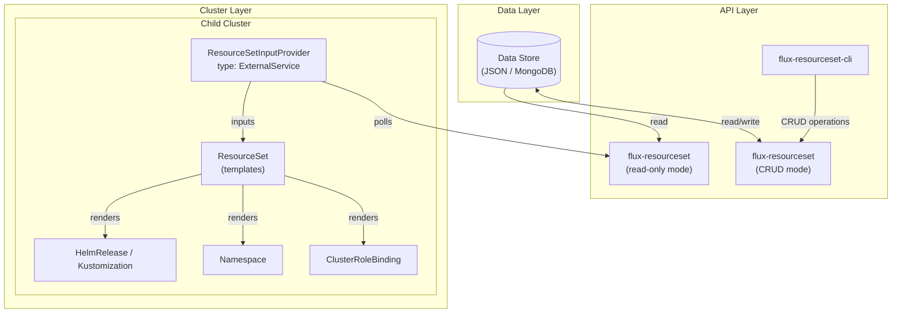
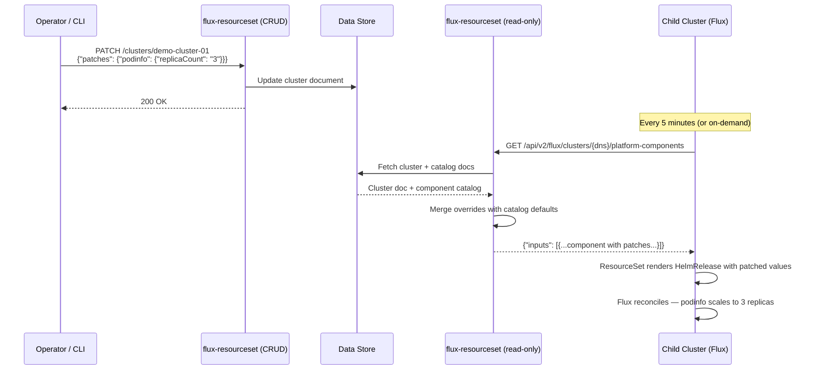

# System Overview

The architecture separates concerns into three layers: the **data plane** (where cluster config lives), the **API plane** (this service), and the **cluster plane** (Flux running on each child cluster).

## High-Level Architecture

## Component Roles

### Data Store

In production, this is MongoDB. In the demo, it is a JSON file (`data/seed.json`) loaded at startup. The data store holds two primary collections:

- **clusters** — each cluster's full configuration: assigned components, namespaces, rolebindings, and per-component patches
- **platform_components** — the component catalog: available components with default versions, OCI URLs, and dependency chains

### API Service (flux-resourceset)

A Rust service built with axum that operates in two modes:

| Mode | Purpose | Endpoints |
|------|---------|-----------|
| `read-only` | Flux polling — high concurrency, minimal resource usage | `/api/v2/flux/...`, `/health`, `/ready` |
| `crud` | Operator/CLI access — full CRUD for managing cluster state | All read endpoints + `/clusters`, `/platform_components`, `/namespaces`, `/rolebindings` |

The read-only mode is designed to run as a multi-replica deployment serving cluster polls. The CRUD mode is for operators and CI/CD pipelines that need to modify cluster configuration.

### CLI (flux-resourceset-cli)

A command-line tool for interacting with the CRUD API. Supports listing, creating, and patching resources. Used for demos and operational workflows.

### Flux Operator (on each cluster)

Each cluster runs:

1. **ResourceSetInputProvider** — calls the API on a schedule, fetches `{"inputs": [...]}`
2. **ResourceSet** — takes the inputs and renders Kubernetes manifests from templates
3. **Flux controllers** — reconcile the rendered manifests (HelmRelease, Kustomization, Namespace, etc.)

## Data Flow

## Why This Architecture

### vs. Push-Based (ArgoCD ApplicationSets, central Flux)

| Concern | Push-based | Phone-home (this) |
|---------|-----------|-------------------|
| **Scalability** | Management cluster must maintain connections to all children | Each cluster independently polls; API is stateless |
| **Failure blast radius** | Management cluster outage = all clusters lose reconciliation | API outage = clusters keep running last-known state |
| **Network requirements** | Management cluster needs outbound access to all clusters | Clusters need outbound access to one API endpoint |
| **Credential management** | Management cluster holds kubeconfigs for all clusters | Each cluster holds one bearer token |

### vs. Git-per-Cluster

| Concern | Git-per-cluster | API-driven (this) |
|---------|-----------------|--------------------|
| **Updating 500 clusters** | 500 PRs or complex monorepo tooling | One API call to update the component catalog |
| **Per-cluster overrides** | Branch strategies or overlay directories | First-class `patches` object per cluster |
| **Audit trail** | Git history | API audit log + Git history for templates |
| **Dynamic response** | Static YAML files | Merge logic computes cluster-specific state |
