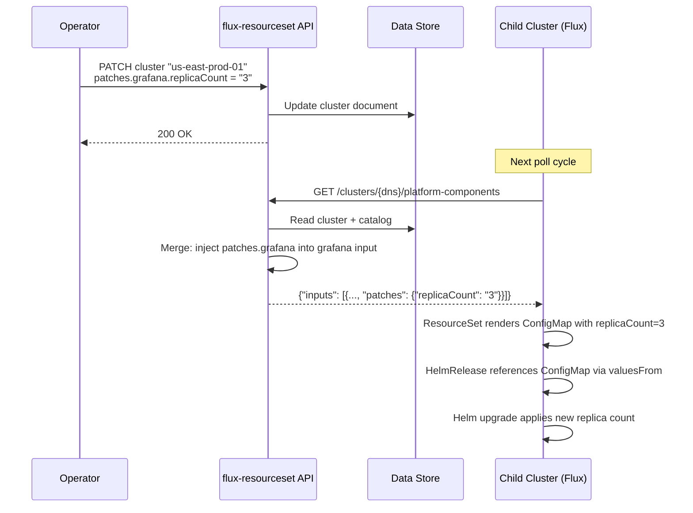
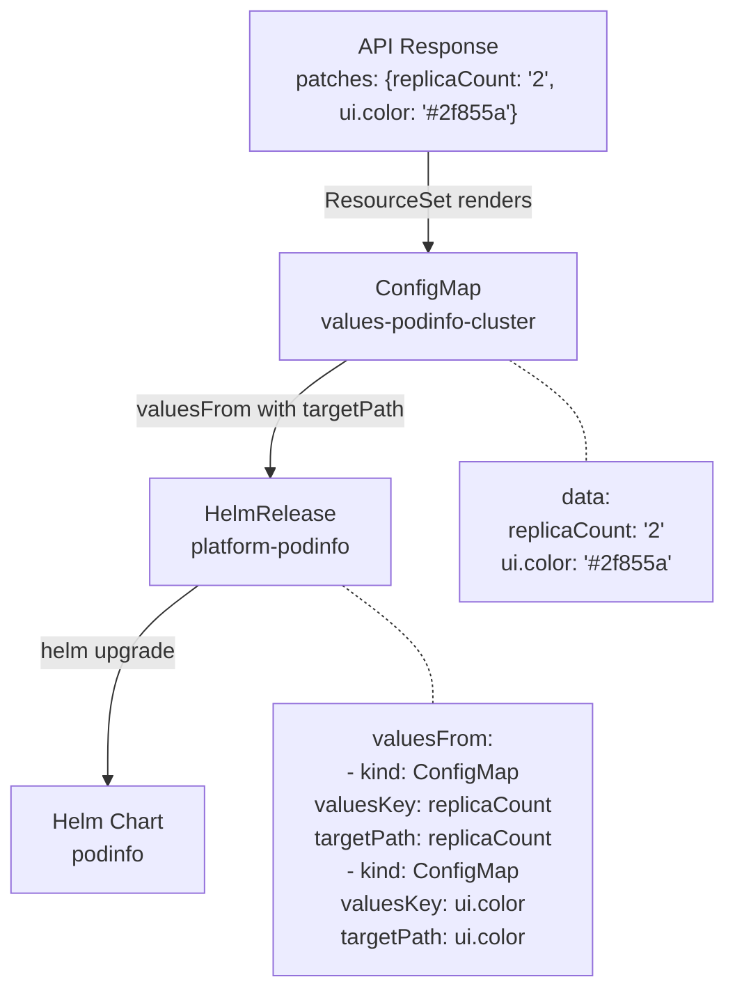

# Dynamic Patching

Dynamic patching is one of the most powerful features of this architecture. It allows per-cluster, per-component value overrides **without modifying Git**, the component catalog, or any template. Operators can change Helm values, replica counts, feature flags, and more — and Flux reconciles the change automatically.

## How Patching Works



## The Patches Object

Patches are stored in the cluster document, keyed by component ID:

```json
{
  "cluster_dns": "us-east-prod-01.k8s.example.com",
  "patches": {
    "grafana": {
      "replicaCount": "3",
      "persistence.storageClassName": "ssd"
    },
    "podinfo": {
      "replicaCount": "2",
      "ui.color": "#2f855a",
      "ui.message": "Hello from patches"
    },
    "traefik": {
      "deployment.replicas": "1",
      "service.type": "ClusterIP"
    }
  }
}
```

Each key in a component's patches maps to a **Helm value path**. Dotted keys (like `ui.color`) map to nested Helm values.

## How Patches Become Helm Values

The ResourceSet template renders patches into a ConfigMap, then references it from the HelmRelease via `valuesFrom`:



The `targetPath` in `valuesFrom` tells Helm where to inject the value in the chart's values tree. This is a standard Flux HelmRelease feature — the innovation is that the values are **computed from the API**, not hardcoded in Git.

## Patching via CLI

The demo includes a CLI command to patch any component with dynamic `key=value` paths:

```bash
# Patch podinfo values on demo-cluster-01
./target/debug/flux-resourceset-cli demo patch-component demo-cluster-01 podinfo \
  --set replicaCount=3 \
  --set ui.message="Hello from CLI patch" \
  --set ui.color="#3b82f6"
```

This updates the cluster document's `patches.podinfo` object in the data store.

## Patching Use Cases

| Use Case | Patch Example | Effect |
|----------|---------------|--------|
| **Scale a component** | `{"replicaCount": "3"}` | Component scales to 3 replicas |
| **Change UI branding** | `{"ui.color": "#ff0000", "ui.message": "Maintenance"}` | Application UI reflects new values |
| **Environment-specific tuning** | `{"resources.limits.memory": "512Mi"}` | Different resource limits per cluster |
| **Feature flags** | `{"feature.newDashboard": "true"}` | Enable features per cluster |
| **Ingress configuration** | `{"ingress.className": "internal"}` | Different ingress class per cluster |

## Patching vs. Other Override Mechanisms

| Mechanism | Scope | Requires Git PR? | Use Case |
|-----------|-------|-------------------|----------|
| **Catalog defaults** | All clusters using the component | Yes (schema change) | Global default values |
| **OCI tag override** | One cluster, one component | No (API call) | Hotfix or canary version |
| **Component path override** | One cluster, one component | No (API call) | Component version upgrade |
| **Patches** | One cluster, one component | No (API call) | Value tuning, feature flags, scaling |
| **Template changes** | All clusters (template is global) | Yes (Git PR) | Changing how resources are rendered |

Patches are the most granular override — they change individual Helm values without affecting any other cluster or component.

## Verifying Patches

After patching, verify the change propagated:

```bash
# Check the HelmRelease values
kubectl get hr -n flux-system platform-podinfo \
  -o jsonpath='replicas={.spec.values.replicaCount} message={.spec.values.ui.message}{"\n"}'

# Check the actual deployment
kubectl get deploy -n podinfo podinfo -o jsonpath='replicas={.spec.replicas}{"\n"}'

# Check the ConfigMap
kubectl get configmap -n flux-system values-podinfo-demo-cluster-01 -o yaml
```
