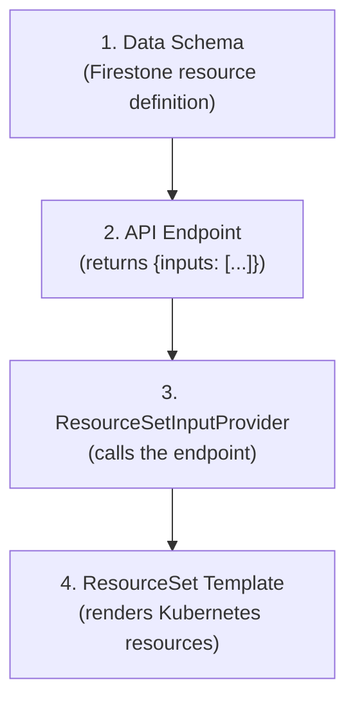

# Extending with New Resource Types

The architecture is designed to be extended with new resource types beyond the initial three (platform-components, namespaces, rolebindings). Adding a new resource type follows a consistent pattern.

## The Pattern

Every resource type requires four pieces:



## Step-by-Step: Adding Network Policies

Let's walk through adding a `network-policies` resource type.

### Step 1: Define the Firestone Schema

Create `resources/network_policy.yaml`:

```yaml
kind: network_policy
apiVersion: v1
schema:
  type: object
  required: [id, target_namespace, ingress_rules]
  properties:
    id:
      type: string
      example: allow-monitoring
    target_namespace:
      type: string
      example: monitoring
    ingress_rules:
      type: array
      items:
        type: object
        properties:
          from_namespace:
            type: string
          port:
            type: integer
```

### Step 2: Add to the Cluster Schema

In `resources/cluster.yaml`, add a `network_policies` array:

```yaml
network_policies:
  type: array
  items:
    $ref: "#/components/schemas/network_policy_ref"
  description: Network policies to sync to this cluster.
```

### Step 3: Regenerate Code

```bash
make generate
```

This updates the OpenAPI spec, Rust models, and CLI modules.

### Step 4: Implement the API Endpoint

Add `GET /api/v2/flux/clusters/{cluster_dns}/network-policies` that returns:

```json
{
  "inputs": [
    {
      "id": "allow-monitoring",
      "target_namespace": "monitoring",
      "ingress_rules": [
        { "from_namespace": "prometheus", "port": 9090 }
      ],
      "cluster": {
        "name": "us-east-prod-01",
        "dns": "us-east-prod-01.k8s.example.com",
        "environment": "prod"
      }
    }
  ]
}
```

### Step 5: Create the ResourceSetInputProvider

```yaml
apiVersion: fluxcd.controlplane.io/v1
kind: ResourceSetInputProvider
metadata:
  name: network-policies
  namespace: flux-system
  annotations:
    fluxcd.controlplane.io/reconcileEvery: "5m"
spec:
  type: ExternalService
  url: "${INTERNAL_API_URL}/api/v2/flux/clusters/${CLUSTER_DNS}/network-policies"
  secretRef:
    name: internal-api-token
```

### Step 6: Create the ResourceSet Template

```yaml
apiVersion: fluxcd.controlplane.io/v1
kind: ResourceSet
metadata:
  name: network-policies
  namespace: flux-system
spec:
  inputsFrom:
    - name: network-policies
  resourcesTemplate: |
    ---
    apiVersion: networking.k8s.io/v1
    kind: NetworkPolicy
    metadata:
      name: << inputs.id >>
      namespace: << inputs.target_namespace >>
    spec:
      podSelector: {}
      policyTypes:
        - Ingress
      ingress:
        <<- range $rule := inputs.ingress_rules >>
        - from:
            - namespaceSelector:
                matchLabels:
                  kubernetes.io/metadata.name: << $rule.from_namespace >>
          ports:
            - port: << $rule.port >>
        <<- end >>
```

### Step 7: Deploy

Add the provider and ResourceSet to the bootstrap manifests (for new clusters) and apply them to existing clusters.

## What Makes This Extensible

| Aspect | How It Helps |
|--------|-------------|
| **Consistent contract** | Every resource type uses `{"inputs": [...]}` — same provider, same pattern |
| **Independent providers** | Each resource type polls independently — no coupling |
| **Schema-driven** | Firestone generates models, OpenAPI, and CLI for new types automatically |
| **Template isolation** | Each ResourceSet template handles one type — no monolithic templates |

## Ideas for Additional Resource Types

| Resource Type | Kubernetes Resources | Use Case |
|---------------|---------------------|----------|
| Network Policies | NetworkPolicy | Per-cluster network segmentation |
| Resource Quotas | ResourceQuota, LimitRange | Namespace resource limits |
| Secrets | ExternalSecret (ESO) | Centralized secret management |
| Ingress Routes | Ingress, IngressRoute | Per-cluster routing rules |
| Custom CRDs | Any custom resource | Organization-specific resources |

Each follows the same four-piece pattern: schema, endpoint, provider, template.
