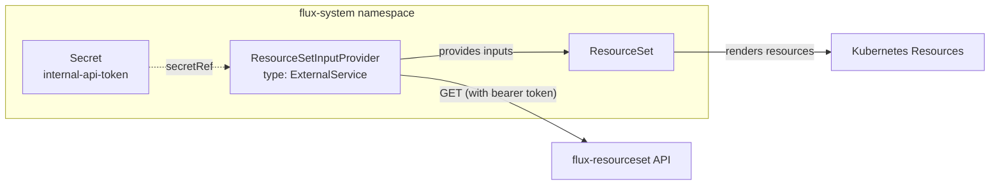

# ResourceSetInputProvider

The [`ResourceSetInputProvider`](https://fluxoperator.dev/docs/crd/resourcesetinputprovider/) is the Flux Operator CRD that tells a ResourceSet where to fetch its input data. In this architecture, every provider uses `type: ExternalService` to call the flux-resourceset API.

> **Upstream reference:** See the full [ResourceSetInputProvider CRD documentation](https://fluxoperator.dev/docs/crd/resourcesetinputprovider/) for all supported input types, authentication options, and status conditions.

## How Providers Work



## Provider Configuration

Each provider specifies:
- **type** — `ExternalService` (calls an HTTP API)
- **url** — the endpoint to call
- **secretRef** — Kubernetes Secret containing the bearer token
- **reconcileEvery** — how often to poll (annotation)

### Platform Components Provider

```yaml
apiVersion: fluxcd.controlplane.io/v1
kind: ResourceSetInputProvider
metadata:
  name: platform-components
  namespace: flux-system
  annotations:
    fluxcd.controlplane.io/reconcileEvery: "30s"
spec:
  type: ExternalService
  url: http://flux-api-read.flux-system.svc.cluster.local:8080/api/v2/flux/clusters/demo-cluster-01.k8s.example.com/platform-components
  insecure: true
  secretRef:
    name: internal-api-token
```

### Namespaces Provider

```yaml
apiVersion: fluxcd.controlplane.io/v1
kind: ResourceSetInputProvider
metadata:
  name: namespaces
  namespace: flux-system
  annotations:
    fluxcd.controlplane.io/reconcileEvery: "30s"
spec:
  type: ExternalService
  url: http://flux-api-read.flux-system.svc.cluster.local:8080/api/v2/flux/clusters/demo-cluster-01.k8s.example.com/namespaces
  insecure: true
  secretRef:
    name: internal-api-token
```

### Rolebindings Provider

Same pattern with `/rolebindings` endpoint.

## URL Construction

In production, the provider URL uses variable substitution from the `cluster-identity` ConfigMap:

```yaml
url: "${INTERNAL_API_URL}/api/v2/flux/clusters/${CLUSTER_DNS}/platform-components"
```

This means the **same provider manifest** works on every cluster — only the ConfigMap values differ.

In the demo, the URL is hardcoded to the in-cluster service address and a demo cluster DNS.

## Authentication

The provider references a Secret that contains the bearer token:

```yaml
apiVersion: v1
kind: Secret
metadata:
  name: internal-api-token
  namespace: flux-system
type: Opaque
stringData:
  token: "your-bearer-token-here"
```

The Flux Operator sends this as `Authorization: Bearer <token>` on every request.

For production, consider:
- **Token rotation** — update the Secret, Flux picks up the new token on next request
- **mTLS** — ResourceSetInputProvider supports `certSecretRef` for TLS client certificates

## Reconciliation Behavior

| Event | Provider Behavior |
|-------|-------------------|
| **Scheduled interval** | Provider calls the API, ResourceSet re-renders if inputs changed |
| **API returns same data** | No change — ResourceSet does not re-render |
| **API returns new data** | ResourceSet re-renders, Flux applies the diff |
| **API returns error** | Provider goes not-ready, existing resources continue running |
| **API unreachable** | Same as error — graceful degradation |
| **Manual trigger** | Annotate with `fluxcd.controlplane.io/requestedAt` to force immediate reconcile |

### Forcing Immediate Reconciliation

```bash
kubectl annotate resourcesetinputprovider platform-components -n flux-system \
  fluxcd.controlplane.io/requestedAt="$(date -u +"%Y-%m-%dT%H:%M:%SZ")" --overwrite
```

## Observing Provider Status

```bash
# Check provider status
kubectl get resourcesetinputproviders -n flux-system

# Detailed status with conditions
kubectl describe resourcesetinputprovider platform-components -n flux-system

# Check ResourceSet status
kubectl get resourcesets -n flux-system
```

## Further Reading

- [ResourceSetInputProvider CRD reference](https://fluxoperator.dev/docs/crd/resourcesetinputprovider/) — full spec, input types, auth options, status conditions
- [ResourceSet CRD reference](https://fluxoperator.dev/docs/crd/resourceset/) — the templating CRD that consumes provider inputs
- [Flux Operator](https://fluxoperator.dev/) — project home with installation guides and examples
