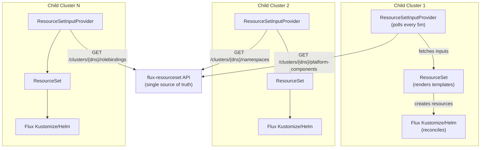

# Flux ResourceSet — External-Service GitOps

`flux-resourceset` is an API service that powers a **phone-home GitOps model** for managing Kubernetes clusters at enterprise scale. Instead of a central management cluster pushing configuration to child clusters, each child cluster **pulls its own desired state** from this API — and Flux reconciles the difference.

## The Problem

Traditional enterprise Kubernetes platforms suffer from:

- **Slow provisioning** — cluster creation taking weeks, not minutes
- **State divergence** — Ansible inventory, CMDB databases, and actual cluster state drifting apart
- **Manual release ceremonies** — PRs, approvals, and tier-by-tier rollouts for every platform component change
- **Scaling bottlenecks** — centralized push-based management that breaks down at hundreds of clusters

## The Solution

This project implements a **resource-driven, pull-based architecture** where:

1. A central API (this service) is the **single source of truth** for cluster configuration
2. Each cluster's Flux Operator **phones home** to fetch its desired state
3. ResourceSet templates **render Kubernetes resources** from the API response
4. Flux **continuously reconciles** — any API change is automatically applied



## What This Service Does

`flux-resourceset` reads cluster configuration data, merges per-cluster overrides with catalog defaults, and returns responses in the `{"inputs": [...]}` format that the Flux Operator's `ResourceSetInputProvider` (ExternalService type) requires.

Each resource type gets its own endpoint:

| Endpoint | What It Returns |
|----------|-----------------|
| `GET /api/v2/flux/clusters/{dns}/platform-components` | HelmRelease + HelmRepository + ConfigMap inputs per component |
| `GET /api/v2/flux/clusters/{dns}/namespaces` | Namespace inputs with labels and annotations |
| `GET /api/v2/flux/clusters/{dns}/rolebindings` | ClusterRoleBinding inputs with subjects |
| `GET /api/v2/flux/clusters` | Cluster list for management plane provisioning |

## Key Concepts

| Concept | Description |
|---------|-------------|
| **Phone-home model** | Clusters pull config; the API never pushes. Scales to thousands of clusters. |
| **Resource-driven development** | Define resources (clusters, components, namespaces) as structured data. Templates turn data into Kubernetes manifests. |
| **Dynamic patching** | Per-cluster, per-component value overrides without touching Git. Change a replica count in the API and watch Flux reconcile. |
| **Catalog + overrides** | Platform components live in a catalog with defaults. Each cluster can override `oci_tag`, `component_path`, or inject custom patches. |
| **ExternalService contract** | All responses follow `{"inputs": [{"id": "...", ...}]}` — the format Flux Operator requires. |

## Quick Start

```bash
cd flux-resourceset
make demo          # Creates kind cluster, installs Flux, deploys API + demo data
make cli-demo      # Runs the CLI demo flow end-to-end
```

See the [Local Demo](./local-demo.md) chapter for full details.
