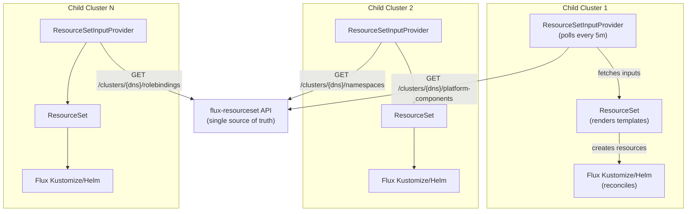

# Flux ResourceSet — API-Driven GitOps

`flux-resourceset` is a repo containing an example API service that powers an **API-driven, GitOps-based model** for managing Kubernetes clusters at enterprise scale. Instead of a central management cluster pushing configuration to child clusters, each child cluster **pulls its own desired state** from this API — and Flux reconciles the difference.

> **A GitOps-based model.** The ResourceSet templates that define *how* resources are rendered live in Git and follow standard GitOps review workflows. The API adds a dynamic data layer on top — *what* each cluster should run is served by the API, while *how* it is deployed is governed by version-controlled templates. The combination preserves GitOps principles (declarative, versioned, continuously reconciled) while adding the operational flexibility that enterprise multi-cluster management demands.

## The Problem

Traditional enterprise Kubernetes platforms suffer from:

- **Slow provisioning** — cluster creation taking weeks, not minutes
- **State divergence** — configuration management tools (Ansible, Terraform, Puppet, Salt, or custom automation scripts), CMDB databases, and actual cluster state drifting apart over time
- **Manual release ceremonies** — PRs, approvals, and tier-by-tier rollouts for every platform component change
- **Scaling bottlenecks** — centralized push-based management that breaks down at hundreds of clusters
- **Infrastructure lock-in** — tooling that assumes a specific cloud provider or VM provisioner, making hybrid and multi-cloud deployments painful

## The Solution

This project implements a **resource-driven, pull-based architecture** where:

1. A central API (this service) is the **single source of truth** for cluster configuration
2. Each cluster's Flux Operator **phones home** to fetch its desired state
3. ResourceSet templates **render Kubernetes resources** from the API response
4. Flux **continuously reconciles** — any API change is automatically applied

This model is **infrastructure-agnostic**. It works on bare-metal on-premises data centers, private cloud, public cloud (AWS EKS, Azure AKS, GCP GKE), edge locations, or any hybrid combination. The only requirement is that each cluster can make outbound HTTPS requests to the API endpoint.



## Key Upstream Projects

This architecture builds on two open-source projects:

- **[Flux Operator](https://fluxoperator.dev/)** — provides the [ResourceSet](https://fluxoperator.dev/docs/crd/resourceset/) and [ResourceSetInputProvider](https://fluxoperator.dev/docs/crd/resourcesetinputprovider/) CRDs that power the templating and phone-home polling. The `ExternalService` input type is the foundation this architecture is built on. ([GitHub](https://github.com/controlplaneio-fluxcd/flux-operator))
- **[Firestone](https://github.com/firestoned/firestone)** — a resource-based API specification generator that converts JSON Schema definitions into OpenAPI specs, CLI tools, and downstream code. Firestone defines the resource schemas (cluster, platform_component, namespace, rolebinding) that drive code generation for this project.

## What This Service Does

`flux-resourceset` reads cluster configuration data, merges per-cluster overrides with catalog defaults, and returns responses in the `{"inputs": [...]}` format that the Flux Operator's [`ResourceSetInputProvider`](https://fluxoperator.dev/docs/crd/resourcesetinputprovider/) (ExternalService type) requires.

Each resource type gets its own endpoint:

| Endpoint | What It Returns |
|----------|-----------------|
| `GET /api/v2/flux/clusters/{dns}/platform-components` | HelmRelease + HelmRepository + ConfigMap inputs per component |
| `GET /api/v2/flux/clusters/{dns}/namespaces` | Namespace inputs with labels and annotations |
| `GET /api/v2/flux/clusters/{dns}/rolebindings` | ClusterRoleBinding inputs with subjects |
| `GET /api/v2/flux/clusters` | Cluster list for management plane provisioning |

## Key Concepts

| Concept | Description |
|---------|-------------|
| **Phone-home model** | Clusters pull config; the API never pushes. Scales to thousands of clusters. |
| **Resource-driven development** | Define resources (clusters, components, namespaces) as structured data. Templates turn data into Kubernetes manifests. |
| **Dynamic patching** | Per-cluster, per-component value overrides without touching Git. Change a replica count in the API and watch Flux reconcile. |
| **Catalog + overrides** | Platform components live in a catalog with defaults. Each cluster can override `oci_tag`, `component_path`, or inject custom patches. |
| **ExternalService contract** | All responses follow `{"inputs": [{"id": "...", ...}]}` — the format Flux Operator requires. |
| **Infrastructure-agnostic** | Works on-prem, in the cloud, at the edge, or across hybrid environments. No vendor lock-in. |

## Quick Start

```bash
cd flux-resourceset
make demo          # Creates kind cluster, installs Flux, deploys API + demo data
make cli-demo      # Runs the CLI demo flow end-to-end
```

See the [Local Demo](./local-demo.md) chapter for full details.
