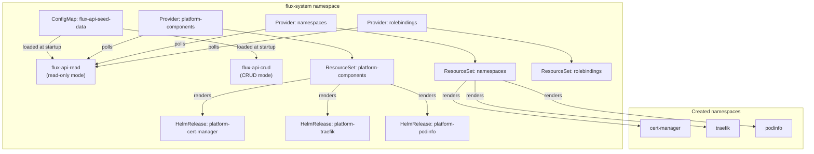

# Local Demo

This guide walks through running the full demo on a local kind cluster. By the end, you will have:

- A kind cluster with Flux Operator installed
- The flux-resourceset API deployed with seed data
- ResourceSetInputProviders polling the API
- ResourceSets rendering and reconciling platform components, namespaces, and rolebindings

## Prerequisites

Required tools:

- **Rust/Cargo** — build the API and CLI
- **Docker** — container runtime for kind
- **kind** — local Kubernetes clusters
- **kubectl** — Kubernetes CLI
- **flux CLI** — manual reconcile commands (`flux reconcile ...`)
- **curl** — HTTP requests

Optional tools:

- **jq** — pretty JSON output
- **Poetry + Python 3** — for `make generate` (code generation only)
- **openapi-generator** — for Rust model generation (code generation only)

## One-Command Demo

```bash
cd flux-resourceset
make demo
```

This runs `kind-create` and `kind-demo`, which:

1. Builds the Docker image (`flux-resourceset:local`)
2. Creates a kind cluster named `flux-demo`
3. Loads the image into the cluster
4. Installs the Flux Operator from upstream
5. Applies base Kubernetes manifests (FluxInstance, RBAC, services)
6. Waits for Flux controllers to be ready
7. Creates a seed data ConfigMap from `data/seed.json`
8. Deploys the API (read-only + CRUD instances)
9. Applies ResourceSetInputProviders
10. Applies ResourceSets

## What Gets Deployed



### Seed Data

The demo uses `data/seed.json` which contains:

**One cluster:** `demo-cluster-01`
- Environment: `dev`
- 3 platform components: cert-manager, traefik, podinfo
- 3 namespaces: cert-manager, traefik, podinfo
- 2 rolebindings: platform-admins (cluster-admin), dev-readers (view)
- Patches for podinfo (replica count, UI color, UI message) and traefik (replicas, service type)

**Three catalog entries:** cert-manager, traefik, podinfo — each pointing to public Helm chart repositories.

## Checking Status

After `make demo`, verify everything is running:

```bash
# Check pods
kubectl get pods -n flux-system

# Check providers
kubectl get resourcesetinputproviders -n flux-system

# Check resourcesets
kubectl get resourcesets -n flux-system

# Check HelmReleases
kubectl get helmreleases -n flux-system

# Check created namespaces
kubectl get namespaces

# Check rolebindings
kubectl get clusterrolebindings platform-admins dev-readers
```

## Running the CLI Demo

The automated CLI demo flow exercises the full lifecycle:

### Step 1: Port-forward the API

```bash
make cli-demo-port-forward
```

This exposes the API on `http://127.0.0.1:8080`.

### Step 2: Run the CLI demo

In another terminal:

```bash
make cli-demo
```

This:
1. Builds the CLI
2. Lists clusters and namespaces
3. Adds a new namespace (`demo-runtime`) via CLI
4. Forces reconciliation
5. Waits for the namespace to be created
6. Verifies the namespace exists

### Step 3: Manual CLI exploration

```bash
export FLUX_API_URL=http://127.0.0.1:8080
export FLUX_API_TOKEN="$(kubectl -n flux-system get secret internal-api-token \
  -o jsonpath='{.data.token}' | base64 -d)"
export FLUX_API_WRITE_TOKEN="$FLUX_API_TOKEN"

# List clusters
./target/debug/flux-resourceset-cli cluster list | jq .

# List namespaces
./target/debug/flux-resourceset-cli namespace list | jq .

# Get Flux-formatted platform components
curl -s -H "Authorization: Bearer $FLUX_API_TOKEN" \
  http://127.0.0.1:8080/api/v2/flux/clusters/demo-cluster-01.k8s.example.com/platform-components | jq .
```

## Podinfo Patch Demo

This demonstrates dynamic patching — changing Helm values via the API and watching Flux reconcile:

```bash
# 1. Check current state
kubectl get configmap -n flux-system values-podinfo-demo-cluster-01 \
  -o jsonpath='replicas={.data.replicaCount} color={.data.ui\.color} message={.data.ui\.message}{"\n"}'
kubectl get deploy -n podinfo podinfo \
  -o jsonpath='replicas={.spec.replicas} color={.spec.template.spec.containers[0].env[?(@.name=="PODINFO_UI_COLOR")].value} message={.spec.template.spec.containers[0].env[?(@.name=="PODINFO_UI_MESSAGE")].value}{"\n"}'

# 2. Patch via CLI
./target/debug/flux-resourceset-cli demo patch-component demo-cluster-01 podinfo \
  --set replicaCount=3 \
  --set ui.message="Hello from CLI patch" \
  --set ui.color="#3b82f6" | jq .

# 3. Force reconcile inputs/templates
kubectl annotate resourcesetinputprovider platform-components -n flux-system \
  fluxcd.controlplane.io/requestedAt="$(date -u +"%Y-%m-%dT%H:%M:%SZ")" --overwrite
kubectl annotate resourceset platform-components -n flux-system \
  fluxcd.controlplane.io/requestedAt="$(date -u +"%Y-%m-%dT%H:%M:%SZ")" --overwrite

# 4. Trigger immediate Helm reconcile
flux reconcile helmrelease platform-podinfo -n flux-system --with-source

# 5. Verify
kubectl get hr -n flux-system platform-podinfo \
  -o jsonpath='ready={.status.conditions[?(@.type=="Ready")].status} reason={.status.conditions[?(@.type=="Ready")].reason} action={.status.lastAttemptedReleaseAction}{"\n"}'
kubectl get configmap -n flux-system values-podinfo-demo-cluster-01 \
  -o jsonpath='replicas={.data.replicaCount} color={.data.ui\.color} message={.data.ui\.message}{"\n"}'
kubectl get deploy -n podinfo podinfo \
  -o jsonpath='replicas={.spec.replicas} color={.spec.template.spec.containers[0].env[?(@.name=="PODINFO_UI_COLOR")].value} message={.spec.template.spec.containers[0].env[?(@.name=="PODINFO_UI_MESSAGE")].value}{"\n"}'

# 6. Optional: check the UI
kubectl -n podinfo port-forward svc/podinfo 9898:9898
# Open http://127.0.0.1:9898
```

## Cleanup

```bash
make kind-delete
# or
make clean
```

This deletes the kind cluster and all associated resources.
