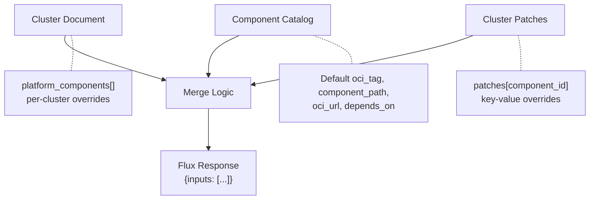
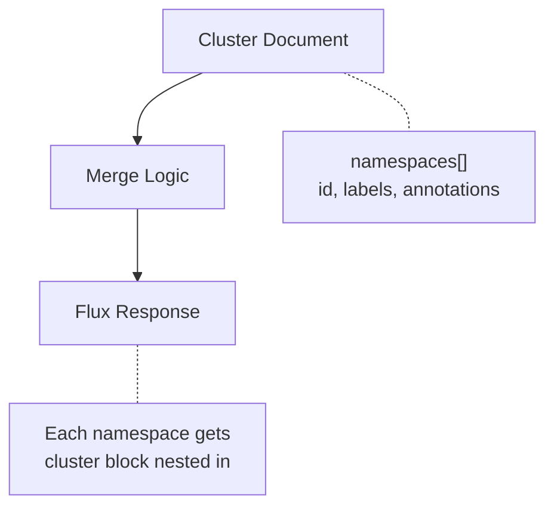

# Merge Logic

The merge logic is the critical path in the API. It takes raw cluster documents and catalog entries and produces the computed response that Flux consumes. Understanding the merge is key to understanding the entire system.

## Platform Components Merge

This is the most complex merge. It combines three data sources into a single response:



### Merge Rules

For each component in the cluster's `platform_components` array:

| Field | Source | Rule |
|-------|--------|------|
| `id` | Cluster component ref | Passed through |
| `enabled` | Cluster component ref | Passed through |
| `component_path` | Cluster override OR catalog default | Cluster override wins if non-null |
| `component_version` | Catalog | Always from catalog |
| `cluster_env_enabled` | Catalog | Always from catalog (template handles path appending) |
| `source.oci_url` | Catalog | Always from catalog |
| `source.oci_tag` | Cluster override OR catalog default | Cluster override wins if non-null |
| `depends_on` | Catalog | Always from catalog |
| `patches` | Cluster `patches[component_id]` | Empty `{}` if no patches for this component |
| `cluster.name` | Cluster doc | From cluster's `cluster_name` |
| `cluster.dns` | Cluster doc | From cluster's `cluster_dns` |
| `cluster.environment` | Cluster doc | From cluster's `environment` |

### Merge Example

Given this cluster document:

```json
{
  "cluster_name": "us-east-prod-01",
  "cluster_dns": "us-east-prod-01.k8s.example.com",
  "environment": "prod",
  "platform_components": [
    { "id": "cert-manager", "enabled": true, "oci_tag": null, "component_path": null },
    { "id": "grafana", "enabled": true, "oci_tag": "v1.0.0-1", "component_path": "observability/grafana/17.1.0" }
  ],
  "patches": {
    "grafana": { "GRAFANA_REPLICAS": "3" }
  }
}
```

And this catalog:

```json
[
  { "_id": "cert-manager", "component_path": "core/cert-manager/1.14.0", "oci_url": "oci://registry/repo", "oci_tag": "v1.0.0", "depends_on": [] },
  { "_id": "grafana", "component_path": "observability/grafana/17.0.0", "oci_url": "oci://registry/repo", "oci_tag": "v1.0.0", "depends_on": ["cert-manager"] }
]
```

The merge produces:

```json
{
  "inputs": [
    {
      "id": "cert-manager",
      "component_path": "core/cert-manager/1.14.0",
      "source": { "oci_url": "oci://registry/repo", "oci_tag": "v1.0.0" },
      "patches": {},
      "cluster": { "name": "us-east-prod-01", "dns": "us-east-prod-01.k8s.example.com", "environment": "prod" }
    },
    {
      "id": "grafana",
      "component_path": "observability/grafana/17.1.0",
      "source": { "oci_url": "oci://registry/repo", "oci_tag": "v1.0.0-1" },
      "depends_on": ["cert-manager"],
      "patches": { "GRAFANA_REPLICAS": "3" },
      "cluster": { "name": "us-east-prod-01", "dns": "us-east-prod-01.k8s.example.com", "environment": "prod" }
    }
  ]
}
```

Notice:
- cert-manager uses catalog defaults for everything (cluster overrides are null)
- grafana uses cluster override for `oci_tag` (`v1.0.0-1`) and `component_path` (`observability/grafana/17.1.0`)
- grafana gets the per-cluster patch (`GRAFANA_REPLICAS: "3"`)

## Namespaces Merge

Simpler — no catalog lookup needed. Data comes directly from `cluster.namespaces`:



Each namespace entry is returned as-is, with the `cluster` block (name, dns, environment) nested into the response.

## Rolebindings Merge

Same pattern as namespaces. Data from `cluster.rolebindings`, with `cluster` block added:

Each rolebinding entry includes `id`, `role`, `subjects[]`, and the nested `cluster` block.

## Why Merge Matters

The merge logic is what makes this system **more than a simple proxy**. It enables:

1. **Catalog defaults** — define a component once, inherit everywhere
2. **Per-cluster overrides** — pin a specific cluster to a hotfix version without affecting others
3. **Per-cluster patches** — inject environment-specific values without touching the component definition
4. **Computed responses** — the cluster gets exactly the state it needs, computed from multiple data sources

Without the merge, you would need to duplicate the full component definition per cluster — which is exactly the problem this architecture solves.
