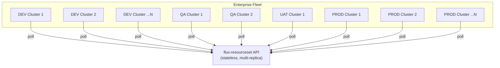
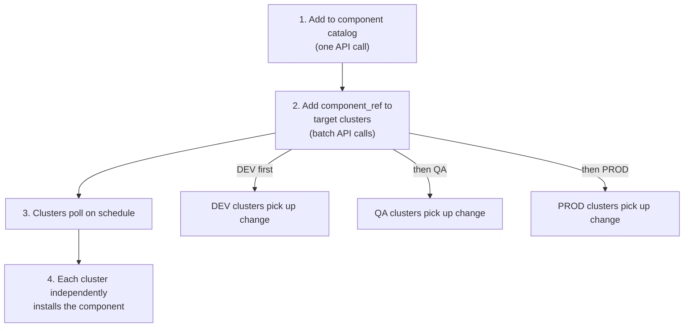
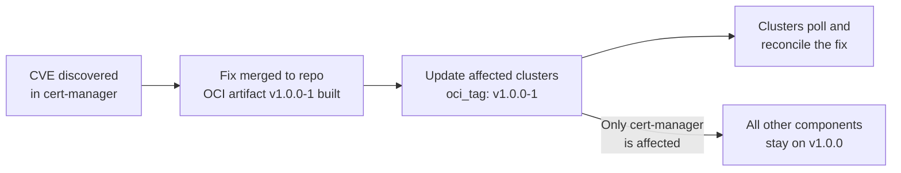
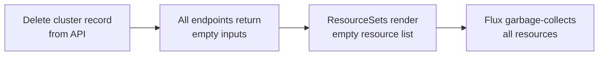

# Multi-Cluster Management

This architecture is designed from the ground up for managing **hundreds to thousands** of Kubernetes clusters. The phone-home model, stateless API, and resource-driven data model all contribute to linear scaling without operational complexity growth.

## Scaling Properties



### Why It Scales

| Property | How |
|----------|-----|
| **Stateless API** | No per-cluster state in the API process. Add replicas for HA, not for capacity. |
| **Pull-based** | Each cluster owns its own reconciliation loop. The API does not need to track cluster connectivity. |
| **Minimal request cost** | Each request = 1 data store read + 1 merge. Sub-millisecond response time. |
| **Independent failures** | One cluster's provider failing does not affect any other cluster. |
| **Linear polling load** | 1,000 clusters polling 3 endpoints every 5 minutes = 10 req/sec. Trivial for any HTTP service. |

## Fleet-Wide Operations

### Rolling Out a New Component

When a new platform component needs to be deployed across the fleet:



You control rollout speed by controlling **when** you add the component_ref to each tier's clusters. No pipeline orchestration — just API calls.

### Upgrading a Component Version

To upgrade grafana from 17.0.0 to 17.1.0 across the fleet:

1. Ensure the new version exists in the platform components OCI artifact
2. Update the catalog's `component_path` from `observability/grafana/17.0.0` to `observability/grafana/17.1.0`
3. All clusters using catalog defaults pick up the change on next poll

For canary rollouts, override specific clusters first:

```json
{
  "platform_components": [
    {
      "id": "grafana",
      "component_path": "observability/grafana/17.1.0",
      "oci_tag": "v1.1.0-rc1"
    }
  ]
}
```

DEV gets the new version. PROD stays on the catalog default.

### Hotfix Workflow



Hotfixes are **per-component, per-cluster**. You update `oci_tag` on the specific component for the specific clusters that need the fix. No full release cycle required.

## Environment Tiers

The architecture has first-class support for environment-based differentiation:

| Mechanism | How It Works |
|-----------|-------------|
| **`cluster.environment`** | Each cluster document has an `environment` field (`dev`, `qa`, `uat`, `prod`). Included in every API response. |
| **`cluster_env_enabled`** | When `true` on a catalog component, the ResourceSet template appends `/{environment}` to the component path. Different environment tiers get different Kustomize overlays. |
| **Per-cluster patches** | Different Helm values per cluster. PROD gets 5 replicas, DEV gets 1. |
| **OCI tag overrides** | DEV clusters can pin to release candidates while PROD stays on stable. |

### Environment-Aware Path Resolution

When `cluster_env_enabled` is `true`:

```
Catalog component_path: core/cert-manager/1.14.0
Cluster environment: prod
→ Resolved path: core/cert-manager/1.14.0/prod
```

This enables the platform components repo to have environment-specific Kustomize overlays:

```
core/cert-manager/1.14.0/
├── base/
│   └── deployment.yaml
├── dev/
│   └── kustomization.yaml
├── qa/
│   └── kustomization.yaml
└── prod/
    └── kustomization.yaml
```

## Decommissioning a Cluster



No manual cleanup. No orphaned resources. The data model drives everything.

## Enterprise Benefits Summary

| Benefit | Description |
|---------|-------------|
| **Single source of truth** | One API holds the desired state for every cluster. No separate configuration management inventory, no spreadsheets, no wiki pages. |
| **Cluster creation in minutes** | Bootstrap cluster + phone home + reconcile. No weeks-long process involving manual playbooks and ticket queues. |
| **Zero state divergence** | API data = ResourceSet input = running cluster state. Drift is automatically corrected. |
| **Operational velocity** | Change a value via API → Flux reconciles. No PR, no review, no pipeline for operational changes. |
| **Audit trail** | Every API mutation is logged. Templates changes go through Git. Full traceability. |
| **Team autonomy** | Platform engineers own templates (Git). Platform operators own data (API). Flux owns reconciliation. |
| **Failure isolation** | Each cluster is independent. API outage = no new changes, not cluster outage. |
| **Cost efficiency** | Stateless API uses minimal resources. No management cluster scaling with fleet size. |
| **Infrastructure-agnostic** | Same model works on-prem, in the cloud, at the edge, or across hybrid environments. No vendor lock-in. |
