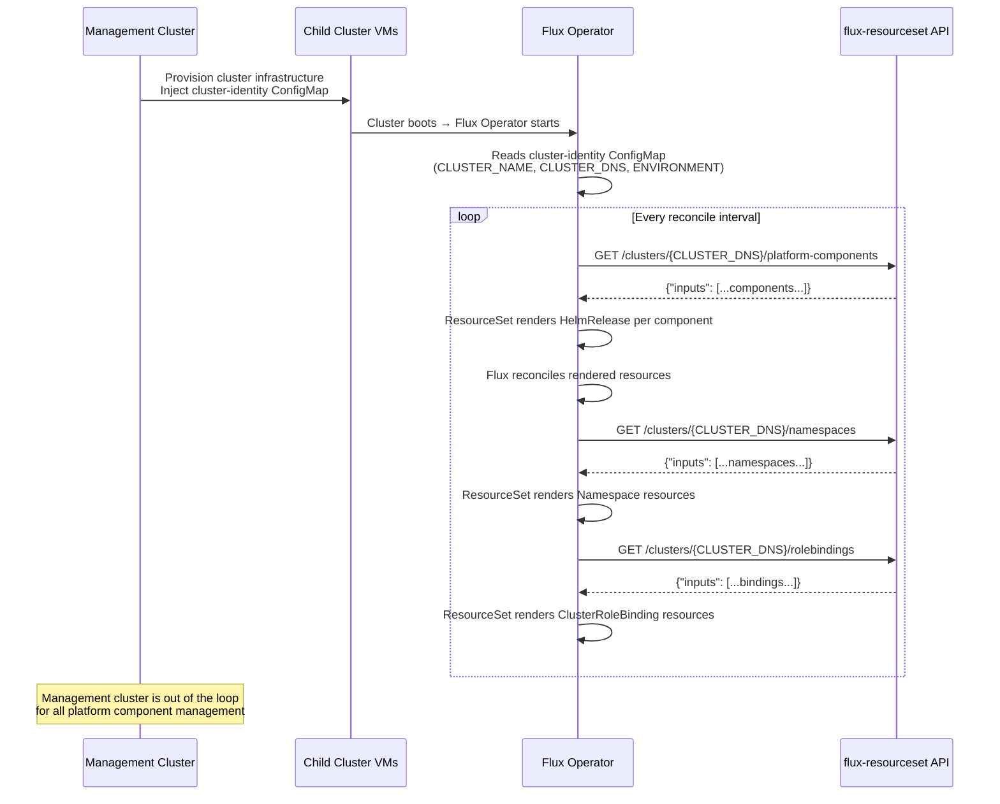
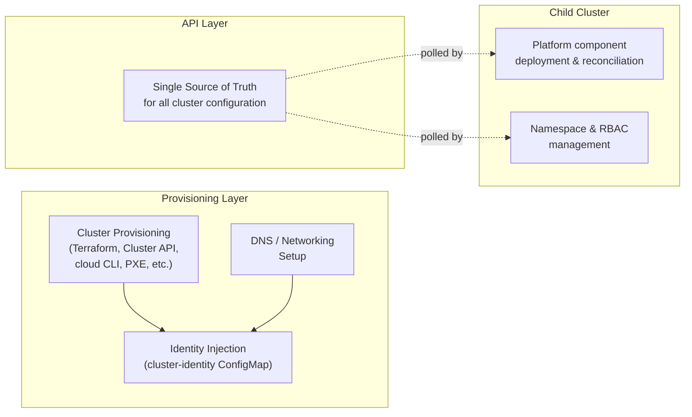

# Phone-Home Model

The phone-home model is the core architectural pattern. Every child cluster is **self-managing** — it phones home to the API to discover its desired state, then reconciles locally. The provisioning layer's only job is creating the cluster infrastructure and injecting a bootstrap identity. After that, the child cluster is autonomous.

## How It Works



## Bootstrap Flow

The bootstrap sequence is designed so that **every cluster starts identically** and differentiates itself only through the API response:

1. **Cluster provisioning** — The infrastructure layer creates the cluster. This could be VMs from immutable OS images, cloud-managed Kubernetes (EKS, AKS, GKE), bare-metal nodes via PXE boot, or any other provisioning method. The Flux Operator bootstrap manifests are pre-installed in the image or applied post-boot.

2. **Identity injection** — A `cluster-identity` ConfigMap is the only cluster-specific data injected during provisioning:

    ```yaml
    apiVersion: v1
    kind: ConfigMap
    metadata:
      name: cluster-identity
      namespace: flux-system
    data:
      CLUSTER_NAME: "us-east-prod-01"
      CLUSTER_DNS: "us-east-prod-01.k8s.internal.example.com"
      ENVIRONMENT: "prod"
      INTERNAL_API_URL: "https://internal-api.internal.example.com"
    ```

3. **Flux bootstrap** — The cluster boots. Pre-installed or applied manifests start the Flux Operator and deploy the ResourceSetInputProviders + ResourceSets.

4. **Phone home** — Each ResourceSetInputProvider calls the API using the cluster's DNS name from the identity ConfigMap. The API returns that cluster's specific configuration.

5. **Self-reconciliation** — Flux renders and reconciles. From this point forward, the cluster is self-managing.

## What Happens When the API Is Unreachable

The phone-home model degrades gracefully:

| Scenario | Cluster Behavior |
|----------|-----------------|
| **API down for minutes** | ResourceSetInputProvider goes not-ready. Existing Flux resources continue reconciling from cached state. No disruption. |
| **API down for hours** | Same — clusters keep running. They just cannot pick up new configuration changes. |
| **API returns changed data** | On next successful poll, ResourceSet re-renders. Flux applies the diff. |
| **API returns empty inputs** | Flux garbage-collects all resources the ResourceSet previously created. This is the decommission path. |

## Separation of Concerns



The provisioning layer **never** deploys platform components to child clusters. It creates infrastructure and injects identity. The child cluster owns its own desired state by polling the API. This separation means the provisioning tooling (whether Terraform, Cluster API, Crossplane, custom scripts, or a management cluster) has no ongoing role in platform component management.

## Per-Resource-Type Providers

Each resource type gets its own ResourceSetInputProvider + ResourceSet pair. This separation ensures:

- **Independent reconciliation** — a namespace change does not trigger platform component re-rendering
- **Independent failure** — if one provider fails, others continue working
- **Clear templates** — each ResourceSet template is focused on one resource type

| Resource Type | Provider Name | Endpoint |
|---------------|---------------|----------|
| Platform components | `platform-components` | `/api/v2/flux/clusters/{dns}/platform-components` |
| Namespaces | `namespaces` | `/api/v2/flux/clusters/{dns}/namespaces` |
| Role bindings | `rolebindings` | `/api/v2/flux/clusters/{dns}/rolebindings` |

All providers are pre-installed in every cluster's bootstrap manifests. The cluster does not need to know what resource types exist — it polls all of them from boot.
