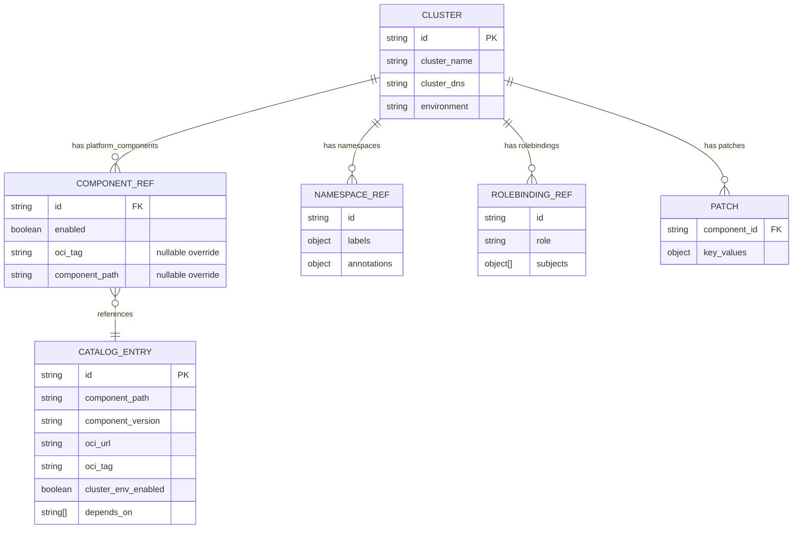
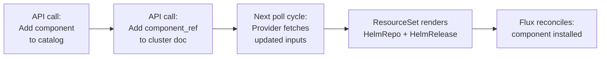
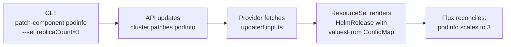

# Resource-Driven Development

Resource-driven development is the design philosophy behind this architecture. Instead of writing imperative scripts or maintaining per-cluster YAML, you **define resources as structured data** and let templates + reconciliation handle the rest.

## The Idea

Every entity in the platform is a **resource** with a schema:

Resources are **declared**, not scripted. The API merges them. Templates render them. Flux reconciles them.

## Three-Layer Separation

The architecture cleanly separates **what** from **how** from **where**:

| Layer | Responsibility | Who Owns It | Example |
|-------|---------------|-------------|---------|
| **Data** | What should exist on each cluster | Platform operators via API/CLI | "Cluster X should have cert-manager v1.14.0 with 3 replicas" |
| **Templates** | How resources are rendered into Kubernetes manifests | Platform engineers via Git | ResourceSet template that turns an input into a HelmRelease |
| **Reconciliation** | Where and when resources are applied | Flux Operator (automated) | Flux detects drift and applies the diff |

This separation means:

- **Operators** change cluster state by updating data (API calls), not by writing YAML
- **Engineers** change how things are deployed by updating templates (Git PRs), not by touching every cluster
- **Flux** handles the convergence loop — no manual `kubectl apply` or Ansible runs

## How a Change Flows Through the System

### Example: Adding a new platform component to 50 clusters

**Traditional approach:**
1. Write Helm values for 50 clusters (or complex overlay structure)
2. Open PR to add component to each cluster's directory
3. Wait for PR review and merge
4. Watch tier-by-tier rollout
5. Debug failures per-cluster

**Resource-driven approach:**
1. Add the component to the catalog (one API call)
2. Add a component reference to each cluster's `platform_components` array (one API call per cluster, or a batch script)
3. Done — Flux picks it up on next poll

### Example: Patching a component value on one cluster

No Git PR. No pipeline. The data change flows through the system automatically.

## Resource Schemas as API Contracts

Each resource type has a defined schema (managed via [Firestone](https://github.com/firestoned/firestone)):

- **cluster** (v2) — the full cluster document with arrays of component refs, namespace refs, rolebinding refs, and a patches object
- **platform_component** (v1) — the catalog entry with OCI URLs, versions, dependencies
- **namespace** (v1) — namespace with labels and annotations
- **rolebinding** (v1) — role binding with subjects

These schemas are the source of truth for:
- OpenAPI spec generation (`openapi/openapi.yaml`)
- Rust model generation (`src/models/`, `src/apis/`)
- CLI code generation (`src/generated/cli/`)

When a schema changes, `make generate` regenerates all downstream artifacts.

## Benefits for Enterprise

### Auditability
Every state change goes through the API. The API can log who changed what, when. Combined with Git history for templates, you have a full audit trail.

### Consistency
The merge logic guarantees that every cluster gets a consistent, computed response. No hand-edited YAML files that drift.

### Velocity
Operators can change cluster state in seconds. No PR cycles for operational changes. Reserve Git PRs for template/structural changes.

### Testability
Because resources are structured data, you can:
- Validate schemas before applying
- Unit test merge logic
- Integration test API responses against the ExternalService contract
- Dry-run template rendering

### Separation of Permissions
- **Template changes** (how things deploy) require Git PR review
- **Data changes** (what is deployed where) require API auth tokens
- **Reconciliation** is automated — no human in the loop
