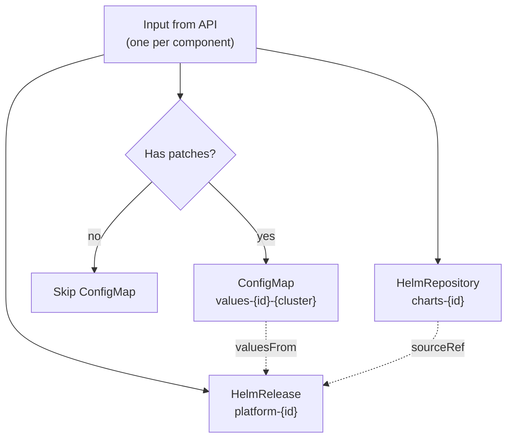

# ResourceSet Templates

ResourceSet templates are the bridge between API data and Kubernetes resources. They use the Flux Operator's templating engine to render manifests from the `{"inputs": [...]}` response.

> **Upstream reference:** See the full [ResourceSet CRD documentation](https://fluxoperator.dev/docs/crd/resourceset/) for all available spec fields, status conditions, and advanced features like inventory tracking and garbage collection.

## Template Syntax

ResourceSet uses `<<` and `>>` as delimiters (not `{{`/`}}`). This avoids conflicts with Helm templates and Go templates in the rendered YAML.

Key template functions:
- `<< inputs.field >>` — access input fields
- `<< inputs.nested.field >>` — access nested objects
- `<< inputs.field | slugify >>` — slugify a string for use in Kubernetes names
- `<<- range $k, $v := inputs.object >>` — iterate over object keys
- `<<- range $item := inputs.array >>` — iterate over arrays
- `<<- if inputs.field >>` — conditional rendering
- `<<- if ne inputs.field "value" >>` — conditional with comparison
- `<< inputs.object | toYaml | nindent N >>` — convert to YAML with indentation

## Platform Components Template

This is the most complex template. For each component input, it renders up to three resources:



### Full Template

```yaml
apiVersion: fluxcd.controlplane.io/v1
kind: ResourceSet
metadata:
  name: platform-components
  namespace: flux-system
spec:
  inputsFrom:
    - name: platform-components
  resourcesTemplate: |
    <<- if inputs.enabled >>
    <<- if inputs.patches >>
    ---
    apiVersion: v1
    kind: ConfigMap
    metadata:
      name: values-<< inputs.id | slugify >>-<< inputs.cluster.name | slugify >>
      namespace: flux-system
    data:
      <<- range $key, $value := inputs.patches >>
      << $key >>: "<< $value >>"
      <<- end >>
    <<- end >>
    ---
    apiVersion: source.toolkit.fluxcd.io/v1
    kind: HelmRepository
    metadata:
      name: charts-<< inputs.id | slugify >>
      namespace: flux-system
    spec:
      interval: 30m
      url: "<< inputs.source.oci_url >>"
    ---
    apiVersion: helm.toolkit.fluxcd.io/v2
    kind: HelmRelease
    metadata:
      name: platform-<< inputs.id >>
      namespace: flux-system
    spec:
      interval: 10m
      releaseName: << inputs.id | slugify >>
      targetNamespace: << inputs.id | slugify >>
      install:
        remediation:
          retries: 3
      upgrade:
        remediation:
          retries: 3
      chart:
        spec:
          chart: << inputs.component_path >>
          sourceRef:
            kind: HelmRepository
            name: charts-<< inputs.id | slugify >>
            namespace: flux-system
          interval: 10m
          <<- if ne inputs.component_version "latest" >>
          version: "<< inputs.component_version >>"
          <<- end >>
      <<- if inputs.depends_on >>
      dependsOn:
        <<- range $dep := inputs.depends_on >>
        - name: platform-<< $dep >>
        <<- end >>
        <<- end >>
      <<- if inputs.patches >>
      valuesFrom:
        <<- range $key, $_ := inputs.patches >>
        - kind: ConfigMap
          name: values-<< inputs.id | slugify >>-<< inputs.cluster.name | slugify >>
          valuesKey: << $key >>
          targetPath: << $key >>
        <<- end >>
      <<- end >>
    <<- end >>
```

### What Each Section Does

**Enabled check** (`<<- if inputs.enabled >>`) — If the component is disabled, nothing is rendered. Flux garbage-collects previously rendered resources.

**ConfigMap for patches** — If the component has patches, a ConfigMap is created with the key-value pairs. The HelmRelease references this ConfigMap via `valuesFrom`, which maps each key to a Helm value path using `targetPath`.

**HelmRepository** — Points to the chart repository URL from `inputs.source.oci_url`.

**HelmRelease** — The core resource. Key behaviors:
- `chart` references the HelmRepository and uses `inputs.component_path` as the chart name
- `version` is only set if `component_version` is not `"latest"`
- `dependsOn` creates ordering dependencies between components
- `valuesFrom` injects per-cluster patches from the ConfigMap

## Namespaces Template

Renders a Kubernetes Namespace for each input:

```yaml
apiVersion: fluxcd.controlplane.io/v1
kind: ResourceSet
metadata:
  name: namespaces
  namespace: flux-system
spec:
  inputsFrom:
    - name: namespaces
  resourcesTemplate: |
    ---
    apiVersion: v1
    kind: Namespace
    metadata:
      name: << inputs.id >>
      labels:
        <<- range $k, $v := inputs.labels >>
        << $k >>: "<< $v >>"
        <<- end >>
      annotations:
        <<- range $k, $v := inputs.annotations >>
        << $k >>: "<< $v >>"
        <<- end >>
```

Labels and annotations from the API response are dynamically rendered using `range`.

## Rolebindings Template

Renders a ClusterRoleBinding for each input:

```yaml
apiVersion: fluxcd.controlplane.io/v1
kind: ResourceSet
metadata:
  name: rolebindings
  namespace: flux-system
spec:
  inputsFrom:
    - name: rolebindings
  resourcesTemplate: |
    ---
    apiVersion: rbac.authorization.k8s.io/v1
    kind: ClusterRoleBinding
    metadata:
      name: << inputs.id >>
    roleRef:
      apiGroup: rbac.authorization.k8s.io
      kind: ClusterRole
      name: << inputs.role >>
    subjects:
      <<- range $s := inputs.subjects >>
      - kind: << $s.kind >>
        name: << $s.name >>
        apiGroup: << $s.apiGroup >>
      <<- end >>
```

## Template Design Principles

1. **One ResourceSet per resource type** — keeps templates focused and failures isolated
2. **Conditional rendering** — use `if` blocks to skip disabled components or optional fields
3. **Slugify names** — Kubernetes resource names must be DNS-compatible; `slugify` handles this
4. **Garbage collection** — when an input disappears from the API response, Flux removes the resources that ResourceSet previously created
5. **No cluster-specific logic in templates** — all cluster differentiation comes from the API data, not from template conditionals

## Further Reading

- [ResourceSet CRD reference](https://fluxoperator.dev/docs/crd/resourceset/) — full spec, status fields, inventory tracking, and health checks
- [ResourceSetInputProvider CRD reference](https://fluxoperator.dev/docs/crd/resourcesetinputprovider/) — input types, polling configuration, authentication options
- [Flux Operator GitHub](https://github.com/controlplaneio-fluxcd/flux-operator) — source code and issue tracker
