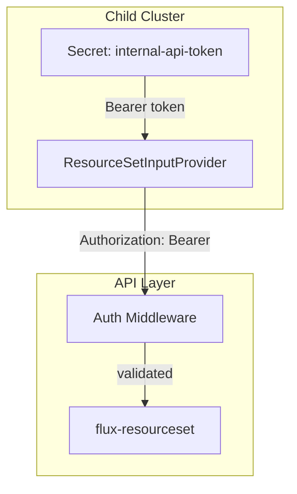

# Security & Authentication

Security in this architecture operates at multiple layers: API authentication, cluster identity, network boundaries, and credential management.

## Authentication Model



### Bearer Token Authentication

The API uses bearer token authentication. Tokens are configured via environment variables:

- `AUTH_TOKEN` — required for all read endpoints
- `CRUD_AUTH_TOKEN` — required for write endpoints in CRUD mode (defaults to `AUTH_TOKEN` if not set)

This separation allows:
- **Read-only clusters** to use a shared read token
- **Operators/CI** to use a separate write token
- **Token rotation** without affecting cluster polling (rotate read and write tokens independently)

### Cluster-Side Token Storage

Each cluster stores the token in a Kubernetes Secret:

```yaml
apiVersion: v1
kind: Secret
metadata:
  name: internal-api-token
  namespace: flux-system
type: Opaque
stringData:
  token: "the-bearer-token"
```

This Secret is either:
- Pre-installed in the cluster's bootstrap image or manifests
- Injected during cluster provisioning (via cloud-init, Terraform, Cluster API, or manual setup)
- Managed by an external secrets operator that fetches the token from a vault

### Upgrading to mTLS

For stricter security requirements, the ResourceSetInputProvider supports TLS client certificates via `certSecretRef`:

```yaml
spec:
  type: ExternalService
  url: https://internal-api.internal.example.com/api/v2/flux/...
  certSecretRef:
    name: api-client-cert
```

This eliminates shared bearer tokens in favor of per-cluster x.509 certificates. The API would need to be configured with a TLS server certificate and a CA trust chain.

## Network Security

### Recommended Network Boundaries

| Connection | Direction | Protocol | Authentication |
|-----------|-----------|----------|----------------|
| Cluster → API | Outbound from cluster | HTTPS | Bearer token or mTLS |
| Operator → API (CRUD) | Inbound to CRUD instance | HTTPS | Bearer token (write) |
| API → Data Store | Internal | MongoDB wire protocol | MongoDB auth |

### Network Policy Considerations

- The API does not need inbound access to clusters — it is purely pull-based
- Only the `flux-system` namespace on each cluster needs outbound access to the API
- CRUD endpoints should be restricted to operator networks or CI/CD runners

## Cluster Identity

The `cluster-identity` ConfigMap is the root of trust for each cluster:

```yaml
data:
  CLUSTER_NAME: "us-east-prod-01"
  CLUSTER_DNS: "us-east-prod-01.k8s.internal.example.com"
  ENVIRONMENT: "prod"
  INTERNAL_API_URL: "https://internal-api.internal.example.com"
```

This ConfigMap determines:
- Which API endpoint the cluster calls
- Which cluster DNS is used in the URL path (determines what data the cluster receives)
- What environment tier the cluster belongs to

The ConfigMap is injected during cluster provisioning and should be treated as immutable after bootstrap.

## Data Access Control

The API enforces access control at the endpoint level:

| Endpoint | Token Required | Access Level |
|----------|---------------|-------------|
| `/api/v2/flux/...` | `AUTH_TOKEN` | Read-only — clusters can only read their own data via DNS path |
| `/clusters`, `/platform_components`, etc. | `CRUD_AUTH_TOKEN` | Read-write — operators can modify any cluster |
| `/health`, `/ready` | None | Public — Kubernetes probes |
| `/openapi.yaml` | None | Public — API documentation |

### Per-Cluster Data Isolation

Each cluster can only access its own data because the API path includes the cluster DNS:

```
GET /api/v2/flux/clusters/us-east-prod-01.k8s.example.com/platform-components
```

A cluster cannot query another cluster's configuration without knowing (and requesting) a different DNS path. The bearer token does not provide cross-cluster access control — all clusters share the same read token. If per-cluster token isolation is required, implement it as an API middleware enhancement.

## Secrets in the Data Model

The patches object supports arbitrary key-value pairs. **Do not store sensitive values** (passwords, API keys, private certificates) in patches. Instead:

- Use Kubernetes Secrets + ExternalSecrets Operator for sensitive values
- Use patches only for non-sensitive configuration (replica counts, feature flags, resource limits)
- For sensitive Helm values, use `valuesFrom` with a Secret instead of a ConfigMap
