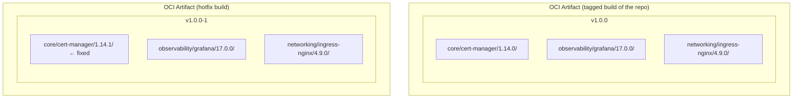
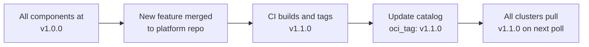
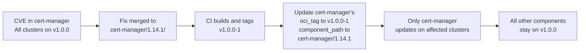
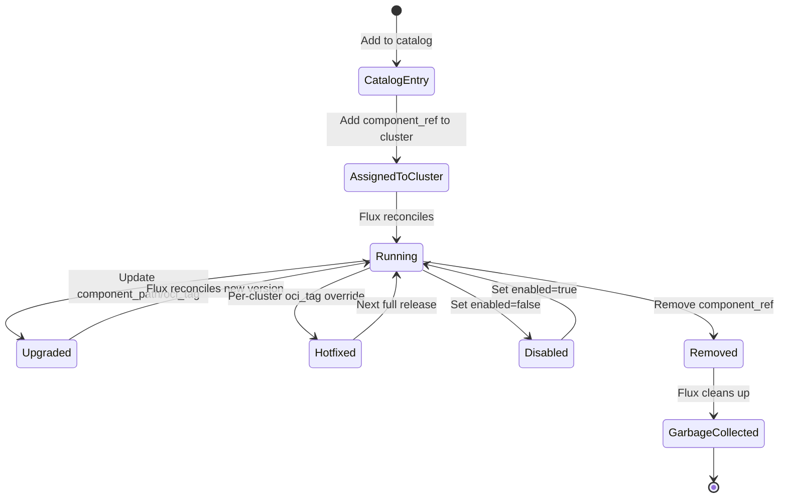

# Versioning & Hotfix Strategy

The platform components repo uses a versioning model with **two independent axes of change**: the OCI artifact tag and the component path within that artifact. This enables fine-grained control over what each cluster runs.

## Two Axes of Version Control



| Axis | What It Controls | How It Changes |
|------|------------------|----------------|
| **OCI tag** | Which build of the monorepo artifact to pull | New tag on each merge to main (`v1.0.0`, `v1.0.0-1`, `v1.1.0`) |
| **Component path** | Which version directory within the artifact to use | Update `component_path` in the API (`observability/grafana/17.0.0` → `17.1.0`) |

## Normal Release Flow



In a normal release, all components point to the same OCI tag. The catalog default is updated, and every cluster picks it up.

## Hotfix Flow



Hotfixes use SemVer pre-release suffixes: `v1.0.0-1`, `v1.0.0-2`. This keeps them:
- **Sortable** — `v1.0.0-1 < v1.0.0-2 < v1.1.0`
- **Tied to base release** — clear which release they patch
- **Temporary** — the next full release collapses everything back to one tag

## Per-Cluster Version Pinning

Any cluster can be pinned to a different version than the catalog default:

```json
{
  "platform_components": [
    {
      "id": "grafana",
      "oci_tag": "v1.1.0-rc1",
      "component_path": "observability/grafana/17.1.0"
    }
  ]
}
```

Use cases:
- **Canary testing** — DEV cluster gets the release candidate
- **Rollback** — pin a PROD cluster to the previous version while investigating
- **Gradual rollout** — update clusters one tier at a time

## Component Lifecycle



## Platform Components Repo Structure

```
appteam-flux-repo/
├── COMPONENTS.yaml              # Registry — CI-validated
├── core/
│   └── cert-manager/
│       ├── 1.14.0/
│       │   ├── base/            # Shared resources
│       │   ├── dev/
│       │   │   └── kustomization.yaml
│       │   ├── qa/
│       │   │   └── kustomization.yaml
│       │   └── prod/
│       │       └── kustomization.yaml
│       └── 1.14.1/              # Hotfix version
│           └── ...
├── observability/
│   └── grafana/
│       ├── 17.0.0/
│       │   └── ...
│       └── 17.1.0/              # Upgrade version
│           └── ...
└── networking/
    └── ingress-nginx/
        └── 4.9.0/
            └── ...
```

Each environment directory must be buildable in isolation: `kustomize build core/cert-manager/1.14.0/prod/` must succeed.

## Version Cleanup

Keep N previous versions per component (recommended: 3). CI can prune older version directories. Old OCI tags remain in the registry for emergency rollbacks.
